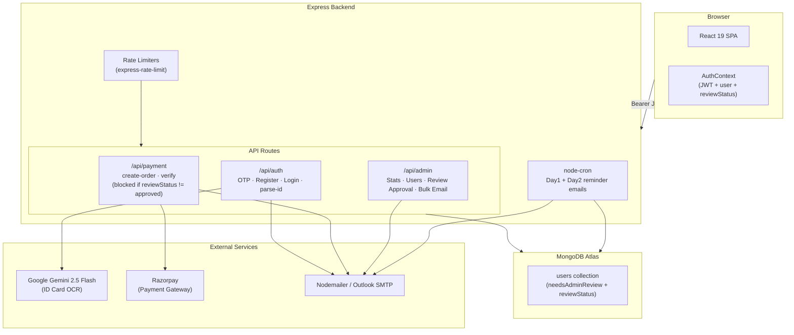
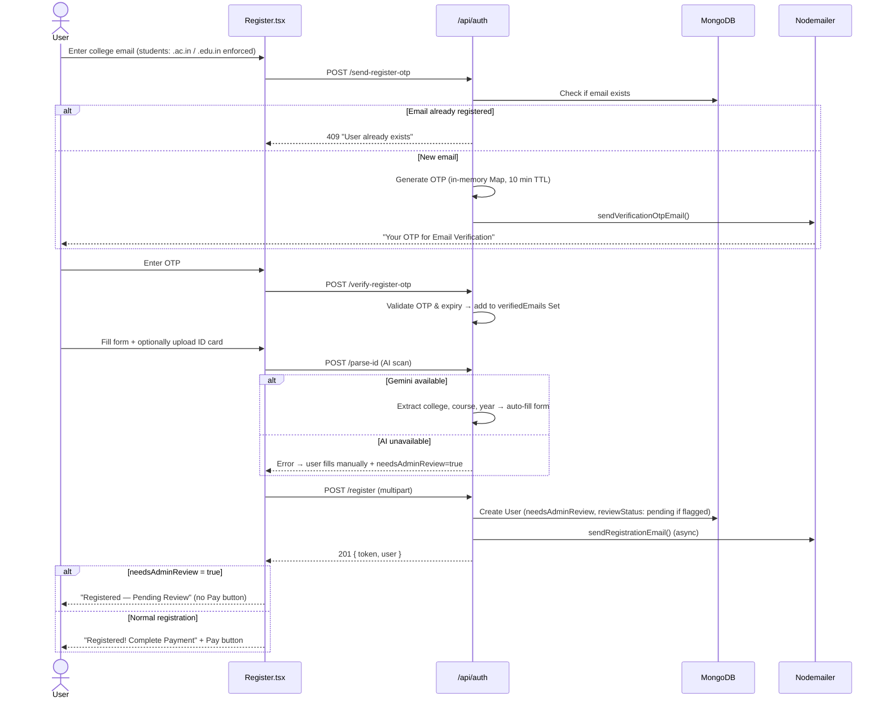
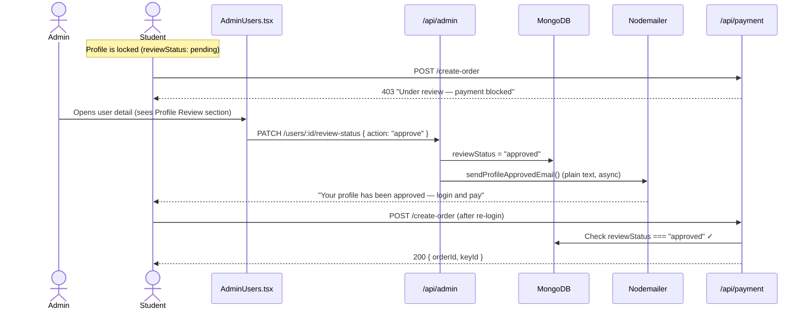
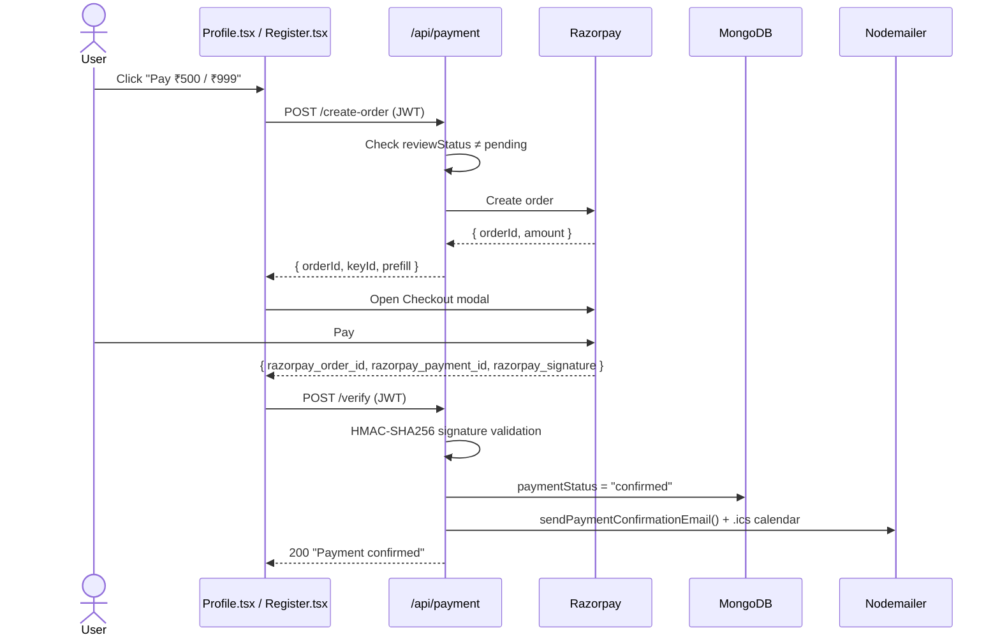

# Lead with AI — Full Stack Application

> **"Lead with AI: Adopt, Implement and Transform"**  
> A 2-day professional AI program hosted by **Global Knowledge Technologies**, offering hands-on learning in Generative AI for students and working professionals.

---

## Table of Contents

1. [Overview](#overview)
2. [Tech Stack](#tech-stack)
3. [Project Structure](#project-structure)
4. [System Architecture](#system-architecture)
5. [Workflow Diagrams](#workflow-diagrams)
6. [Pages & Features](#pages--features)
7. [API Reference](#api-reference)
8. [Database Schema](#database-schema)
9. [Authentication & Security](#authentication--security)
10. [Email System](#email-system)
11. [Admin Panel](#admin-panel)
12. [Environment Variables](#environment-variables)
13. [Getting Started](#getting-started)
14. [Design System](#design-system)

---

## Overview

**Lead with AI** is a full-stack event registration portal for a 2-day hands-on AI program. It combines a luxury-editorial frontend with a Node.js/Express backend to deliver:

- Animated public marketing site with program details, speaker bios, and curriculum
- **College email domain restriction** for students (`.ac.in`, `.edu.in`, `.edu` only)
- OTP-based passwordless auth with **separate emails** for verification vs. login
- **AI-powered student ID card scanning** (Google Gemini 2.5 Flash) to auto-fill college details, with a manual fallback when AI is unavailable
- **Admin-gated registration**: when AI verification is skipped, the profile is flagged `needsAdminReview=true` and payment is blocked until admin approves
- Integrated **Razorpay payment gateway** (₹500 for students / ₹999 for professionals)
- Secure admin panel with approval workflow, user search/filter, and bulk email
- Automated transactional emails: verification OTP, login OTP, registration confirmation, payment receipt with `.ics` calendar, Day 1 & Day 2 reminder emails, and profile approval notification
- **OTP rate limiting** via `express-rate-limit` to prevent brute-force and SMTP abuse

---

## Tech Stack

### Frontend

| Category | Technology |
|---|---|
| Framework | React 19 |
| Bundler | Vite 7 |
| Routing | Wouter 3 |
| Styling | Vanilla CSS (bespoke design system) |
| Animation | Framer Motion |
| Icons | Lucide React + React Icons |
| Fonts | Playfair Display, EB Garamond, DM Sans (Google Fonts) |

### Backend

| Category | Technology |
|---|---|
| Runtime | Node.js |
| Framework | Express 4 |
| Database | MongoDB Atlas (Mongoose 8) |
| Authentication | JWT (jsonwebtoken) + bcryptjs OTP hashing |
| Rate Limiting | express-rate-limit |
| Payments | Razorpay SDK |
| File Uploads | Multer (JPEG / PNG only, max 10 MB) |
| AI OCR | Google Gemini 2.5 Flash (`@google/genai`) |
| Email | Nodemailer (SMTP — Microsoft Outlook) |
| Cron Jobs | node-cron (reminder emails) |
| Excel Parsing | ExcelJS (college list from `.xlsx`) |

---

## Project Structure

```
Next-Lead/
├── backend/
│   ├── src/
│   │   ├── middleware/
│   │   │   ├── auth.js                # JWT auth middleware (user)
│   │   │   └── adminAuth.js           # JWT auth middleware (admin)
│   │   ├── models/
│   │   │   ├── User.js                # Mongoose User schema + OTP methods
│   │   │   └── Admin.js               # Admin credentials model
│   │   ├── routes/
│   │   │   ├── auth.js                # Registration, OTP, login, ID parse
│   │   │   ├── payment.js             # Razorpay order + verify (payment-gated)
│   │   │   └── admin.js               # Stats, users, bulk email, review approval
│   │   └── utils/
│   │       └── email.js               # All Nodemailer email templates
│   ├── uploads/                       # Uploaded ID card images (gitignored)
│   ├── index.js                       # Express entry point + rate limiters + cron
│   ├── .env                           # Backend secrets (gitignored)
│   └── package.json
│
├── frontend/
│   ├── public/
│   │   ├── Logo.png                   # Main site logo
│   │   ├── LogoAdmin.png              # Admin sidebar logo
│   │   ├── colleges.xlsx              # College name dataset for validation
│   │   └── ...                        # Speaker images, brochure, favicon
│   ├── src/
│   │   ├── components/
│   │   │   ├── NavBar.tsx
│   │   │   ├── Footer.tsx
│   │   │   ├── SixThings.tsx
│   │   │   ├── Autocomplete.tsx       # College autocomplete with live API search
│   │   │   └── ScrollToTop.tsx
│   │   ├── context/
│   │   │   └── AuthContext.tsx        # Global auth state (JWT + user + reviewStatus)
│   │   ├── lib/
│   │   │   ├── api.ts                 # Fetch wrapper with env-aware base URL
│   │   │   └── assets.ts              # publicAsset() helper for /public files
│   │   ├── pages/
│   │   │   ├── Home.tsx
│   │   │   ├── Program.tsx
│   │   │   ├── Speakers.tsx
│   │   │   ├── Register.tsx           # Multi-step: OTP → Form → AI scan → Payment
│   │   │   ├── Profile.tsx            # Attendee profile + payment gate + review notice
│   │   │   └── admin/
│   │   │       ├── AdminLogin.tsx
│   │   │       ├── AdminLayout.tsx    # Sidebar with LogoAdmin.png
│   │   │       ├── AdminOverview.tsx
│   │   │       ├── AdminUsers.tsx     # Review approval workflow
│   │   │       └── AdminEmail.tsx
│   │   ├── index.css                  # Full design system
│   │   ├── admin.css
│   │   ├── App.tsx
│   │   └── main.tsx
│   ├── .env
│   └── package.json
│
├── .gitignore
└── README.md
```

---

## System Architecture



---

## Workflow Diagrams

### Registration Flow



---

### Admin Review & Payment Unlock Flow



---

### Payment Flow



---

## Pages & Features

### Public Pages

| Route | Component | Description |
|---|---|---|
| `/` | `Home.tsx` | Hero, Six Core Takeaways grid, schedule, CTA |
| `/program` | `Program.tsx` | Full 2-day curriculum breakdown |
| `/speakers` | `Speakers.tsx` | Speaker bio cards |
| `/register` | `Register.tsx` | Multi-step: email OTP → form + AI ID scan → payment |
| `/profile` | `Profile.tsx` | Attendee profile, payment gate, review notice |

### Register.tsx — Key Features

- **College email domain guard** (students): enforces `.ac.in`, `.edu.in`, `.edu` both client-side and server-side
- **Separate OTP emails**: Verification OTP ("Your OTP for Email Verification") vs Login OTP ("Your Login OTP, [Name]")
- **AI ID scan**: uploads JPEG/PNG to `/api/auth/parse-id`; Gemini extracts college, course, year and auto-fills form. Validates college against `colleges.xlsx`.
- **Manual fallback**: if AI is unavailable, student fills form manually and registration is flagged for admin review
- **Post-registration screen**: shows "Pending Review" (no Pay button) or "Complete Payment" depending on `needsAdminReview`
- **Tiered pricing**: students pay ₹500, working professionals pay ₹999

### Profile.tsx — Key Features

- Shows registered event, payment status, Zoom link (post-payment)
- **Payment gate**: if `needsAdminReview && reviewStatus !== 'approved'` → shows "Under Review" notice instead of Pay button
- Updates dynamically after admin approves

### Admin Panel (Protected)

| Route | Component | Description |
|---|---|---|
| `/admin/login` | `AdminLogin.tsx` | Admin email + password login |
| `/admin/dashboard` | `AdminOverview.tsx` | Stats: total, paid, revenue, recent sign-ups |
| `/admin/users` | `AdminUsers.tsx` | Full registrant table + review approval |
| `/admin/email` | `AdminEmail.tsx` | Bulk email composer |

**AdminUsers.tsx — Review Workflow:**

| User State | Admin Sees |
|---|---|
| `isPaid = true` | "Approved & Paid — registration complete" |
| `reviewStatus = approved` (not yet paid) | "Approved — payment enabled, awaiting payment" |
| `reviewStatus = pending` / `not_required` | **"Approve & Enable Payment" button** |

---

## API Reference

> **Base URL (dev):** `http://localhost:4000`  
> **Protected routes:** `Authorization: Bearer <JWT>`

### Auth — `/api/auth`

| Method | Endpoint | Auth | Description |
|---|---|---|---|
| `POST` | `/send-register-otp` | None | Check email uniqueness + domain → send verification OTP (rate limited: 5/15min) |
| `POST` | `/verify-register-otp` | None | Verify OTP; marks email eligible for registration (rate limited: 10/15min) |
| `POST` | `/parse-id` | None | Upload ID card (JPEG/PNG, max 10 MB); Gemini extracts college/course/year |
| `POST` | `/register` | None | Create account (requires verified email); sets `needsAdminReview` if flagged (rate limited: 3/hr) |
| `POST` | `/send-otp` | None | Send login OTP to existing user (rate limited: 5/15min) |
| `POST` | `/verify-otp` | None | bcrypt OTP verify → JWT (rate limited: 10/15min) |
| `GET` | `/me` | ✅ JWT | Full user profile (excludes `otpHash`, `otpExpiry`) |

### Payment — `/api/payment`

| Method | Endpoint | Auth | Description |
|---|---|---|---|
| `POST` | `/create-order` | ✅ JWT | Creates Razorpay order; **blocked (403) if `needsAdminReview && reviewStatus !== approved`** |
| `POST` | `/verify` | ✅ JWT | HMAC-SHA256 verify → marks payment confirmed; sends receipt email |

### Admin — `/api/admin`

| Method | Endpoint | Auth | Description |
|---|---|---|---|
| `POST` | `/login` | None | Admin login → admin JWT (24h) |
| `GET` | `/stats` | ✅ Admin | Total users, paid count, 5 recent sign-ups |
| `GET` | `/users` | ✅ Admin | All registrants with `reviewStatus`, `isPaid`, `idCardPath` |
| `GET` | `/users/:id` | ✅ Admin | Single user detail |
| `DELETE` | `/users/:id` | ✅ Admin | Delete a user |
| `PATCH` | `/users/:id/review-status` | ✅ Admin | `{ action: "approve" \| "reject" }` → updates `reviewStatus`, sends approval email |
| `POST` | `/send-email` | ✅ Admin | Bulk email to `all` / `paid` / `custom` list |

### Misc

| Method | Endpoint | Description |
|---|---|---|
| `GET` | `/api/health` | `{ status: "ok", timestamp }` |
| `GET` | `/uploads/:filename` | Serve uploaded ID card images (no auth — see security notes) |

---

## Database Schema

### `User` Collection

```js
{
  fullName:   String (required, trimmed),
  email:      String (unique, lowercase),
  phone:      String (required),
  userType:   "student" | "working",

  // Student-only
  collegeName:      String,
  course:           String,
  year:             String,           // e.g. "3rd Year"
  idCardPath:       String,           // filename in /uploads
  needsAdminReview: Boolean,          // true when AI scan was skipped
  reviewStatus:     "not_required" | "pending" | "approved",

  // Working professional-only
  domain:       String,
  organization: String,

  // OTP login (cleared after use)
  otpHash:    String,   // bcrypt hash
  otpExpiry:  Date,     // 10-min TTL

  // Events
  registeredEvents: [{
    eventName:         String,
    razorpayOrderId:   String,
    razorpayPaymentId: String,
    paymentStatus:     "pending" | "confirmed" | "failed",
    registeredAt:      Date,
  }],

  createdAt: Date,  // auto
  updatedAt: Date,  // auto
}
```

---

## Authentication & Security

### Registration — 3-Step

1. `POST /send-register-otp` — validates email uniqueness + domain; stores OTP in in-memory Map (10 min TTL)
2. `POST /verify-register-otp` — validates OTP; adds to `verifiedEmails` Set
3. `POST /register` — rejects if email not in Set; creates user; clears email from Set

### Login — 2-Step

1. `POST /send-otp` → bcrypt-hashed OTP stored in MongoDB
2. `POST /verify-otp` → `bcrypt.compare()` + expiry check → JWT (30 days), OTP cleared from DB

### OTP Rate Limiting

| Route | Limit | Window |
|---|---|---|
| `send-otp`, `send-register-otp` | 5 requests | 15 min |
| `verify-otp`, `verify-register-otp` | 10 attempts | 15 min |
| `register` | 3 attempts | 1 hour |

### JWT

| Property | Value |
|---|---|
| Algorithm | HS256 |
| User expiry | 30 days |
| Admin expiry | 24 hours |
| Transport | `Authorization: Bearer <token>` |

### Payment Gate

Payment creation is server-side blocked when `needsAdminReview === true && reviewStatus !== 'approved'`. This cannot be bypassed client-side.

---

## Email System

All emails sent via Nodemailer (SMTP) asynchronously (non-blocking).

| Function | Trigger | Type | Notes |
|---|---|---|---|
| `sendVerificationOtpEmail()` | Registration email OTP | HTML | "Your OTP for Email Verification" — no name |
| `sendOtpEmail()` | Login OTP | HTML | "Your Login OTP, [FirstName]" |
| `sendRegistrationEmail()` | Account created | Plain text | Welcome + payment reminder |
| `sendPaymentConfirmationEmail()` | Payment verified | HTML | Receipt + `.ics` Google Calendar attachment |
| `sendProfileApprovedEmail()` | Admin approves review | Plain text | Tells student to login and pay |
| `sendCustomBulkEmail()` | Admin bulk send | HTML | All / Paid / Custom |
| `sendReminderEmail()` | Cron — Day before event | HTML | Zoom link to paid users |
| `sendDay2ReminderEmail()` | Cron — End of Day 1 | HTML | Day 2 reminder to paid users |

### Cron Jobs

```
Day 1 Reminder: 9:00 AM IST (03:30 UTC) — fires day before event
Day 2 Reminder: 6:30 PM IST (13:00 UTC) — fires on Day 1 evening
Timezone: Asia/Kolkata
```

---

## Admin Panel

- **Overview** — Total registrations, paid count, revenue, recent activity
- **Users Table** — Search, filter by type/payment/review status. Expand any row to see full details, ID card image, and the review action
- **Profile Review** — Approve button visible only when `needsAdminReview=true` and not yet paid. Clicking Approve sets `reviewStatus='approved'` and triggers the approval email
- **Bulk Email** — Rich HTML compose to All / Paid / Custom list
- **Sidebar** — Uses `LogoAdmin.png` from `frontend/public/`

---

## Environment Variables

### Backend (`backend/.env`)

```env
PORT=4000
MONGO_URI=mongodb+srv://<user>:<pass>@cluster0.xxx.mongodb.net/LeadWithAI
MONGO_DB_NAME=LeadWithAI
COLLECTION_NAME=Users

JWT_SECRET=<strong_random_secret>

RAZORPAY_KEY_ID=rzp_test_xxxxxxxxxxxx
RAZORPAY_KEY_SECRET=<razorpay_secret>

SMTP_HOST=smtp-mail.outlook.com
SMTP_PORT=587
SMTP_USER=events@yourdomain.com
SMTP_PASS=<smtp_password>
FROM_EMAIL=events@yourdomain.com
FROM_NAME=Lead with AI

GEMINI_API_KEY=<gemini_api_key>

SITE_URL=https://project.globalknowledgetech.com/leadwithAI
ZOOM_LINK=https://zoom.us/j/00000000000
```

### Frontend (`frontend/.env`)

```env
VITE_API_URL=http://localhost:4000
```

> ⚠️ **Never commit `.env` files.** Both are in `.gitignore`.

---

## Getting Started

### Prerequisites

- Node.js v18+
- MongoDB Atlas (or local MongoDB)
- Razorpay account (test or live)
- Google Gemini API key
- SMTP email account

### Installation

```bash
git clone https://github.com/akshayaav246-collab/LeadwithAI.git
cd LeadwithAI

cd backend && npm install
cd ../frontend && npm install
```

### Run Development

```bash
# Terminal 1 — Backend
cd backend
npm run dev
# → http://localhost:4000

# Terminal 2 — Frontend
cd frontend
npm run dev
# → http://localhost:5173
```

---

## Design System

Bespoke luxury-editorial CSS in `frontend/src/index.css`:

**Color palette (CSS variables):**

| Variable | Value | Usage |
|---|---|---|
| `--color-cream` | `#FAF7F2` | Page background |
| `--color-linen` | `#F5F0E8` | Card backgrounds |
| `--color-sienna` | `#C4956A` | Primary accent, buttons, links |
| `--color-espresso` | `#3B2F2F` | Dark headings, navbar |
| `--color-umber` | `#6B4F3A` | Body text, hints |
| `--color-stone` | `#8C7B6B` | Labels, muted text |
| `--color-amber-deep` | `#966638` | Error/validation messages |

**Typography:** `Playfair Display` (headings) · `EB Garamond` (body) · `DM Sans` (UI)

**Error/Status classes:**
- `.field-error` — inline field validation (amber-deep, no red)
- `.field-hint` — soft domain warning (umber)
- `.field-success` — OTP sent confirmation (sienna-dark)
- `.register-error` — global error banner (parchment bg + sienna left border)

**Animations:** Intersection Observer scroll-reveal, Framer Motion page transitions, hover lift effects

---

## License

This project is private and proprietary to **Global Knowledge Technologies**. All rights reserved.