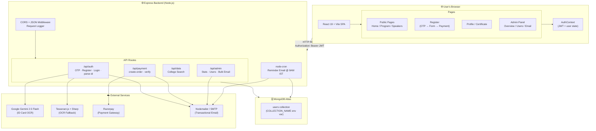
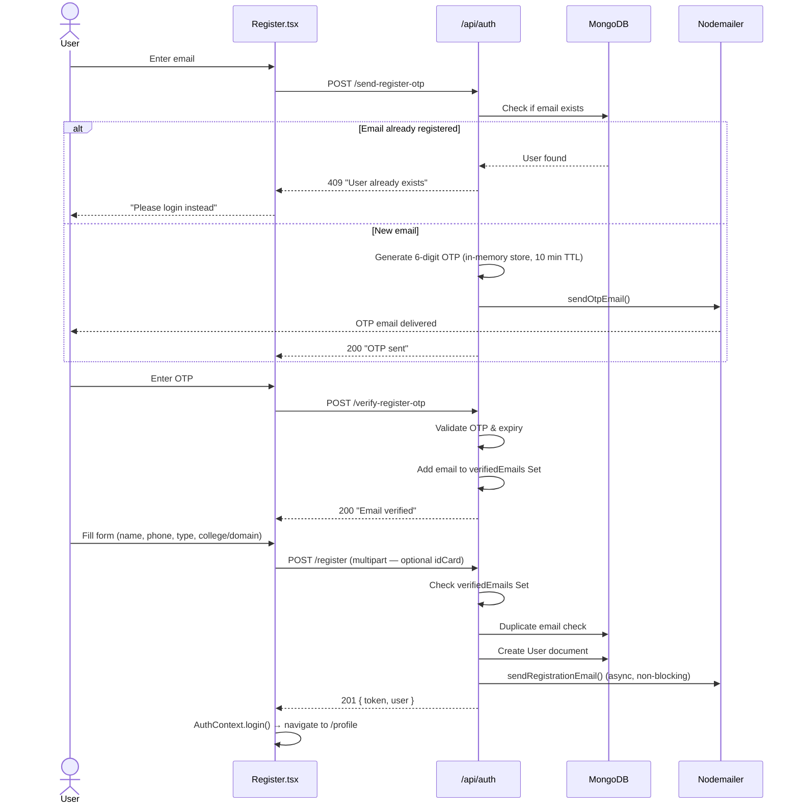
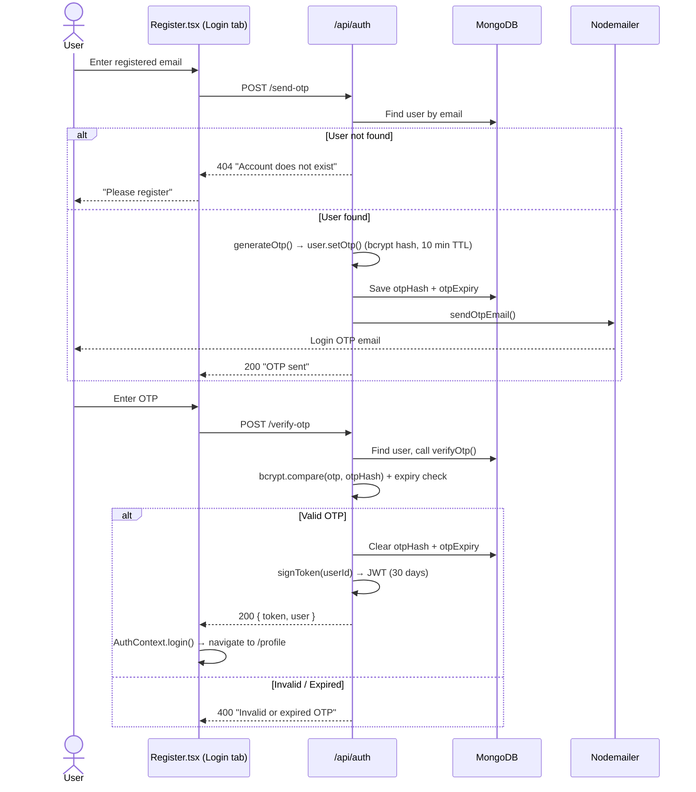
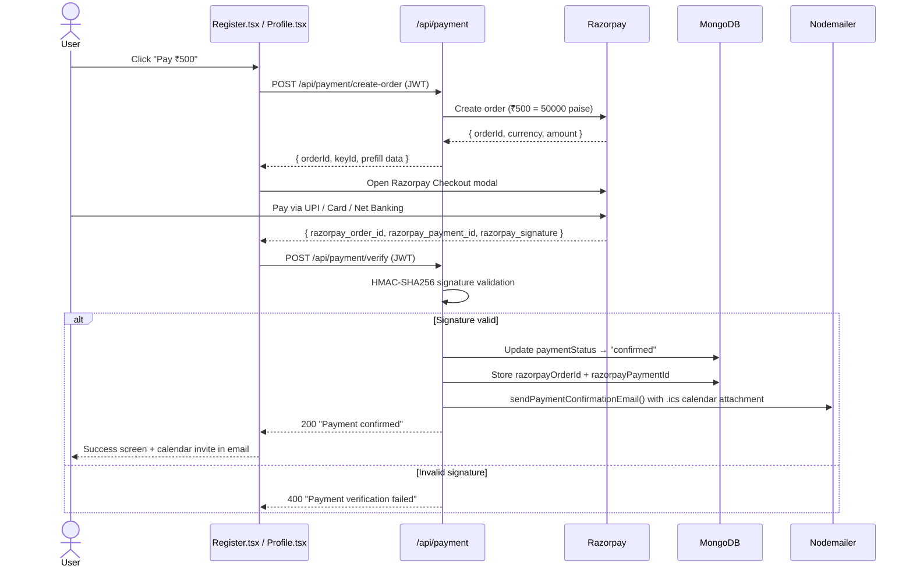
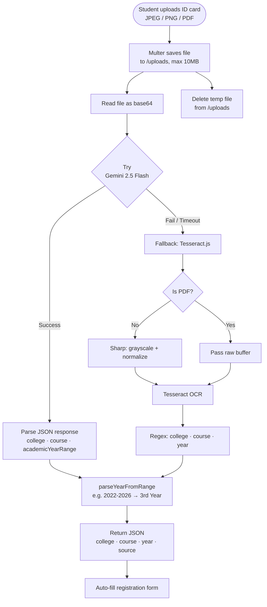

# Lead with AI — Full Stack Application

> **"Lead with AI: Adopt, Implement and Transform"**  
> A 2-day professional AI program hosted by **Global Knowledge Technologies**, offering hands-on learning in Generative AI for students and working professionals.

---

## Table of Contents

1. [Overview](#overview)
2. [Tech Stack](#tech-stack)
3. [Project Structure](#project-structure)
4. [System Architecture](#system-architecture)
5. [Workflow Diagrams](#workflow-diagrams)
   - [Registration Flow](#registration-flow)
   - [Login Flow](#login-flow)
   - [Payment Flow](#payment-flow)
   - [AI ID Card Scanning Flow](#ai-id-card-scanning-flow)
6. [Pages & Features](#pages--features)
7. [API Reference](#api-reference)
8. [Database Schema](#database-schema)
9. [Authentication & Security](#authentication--security)
10. [Email System](#email-system)
11. [Admin Panel](#admin-panel)
12. [Environment Variables](#environment-variables)
13. [Getting Started](#getting-started)
14. [Available Scripts](#available-scripts)
15. [Design System](#design-system)

---

## Overview

**Lead with AI** is a full-stack web application that serves as the marketing and registration platform for a 2-day hands-on AI program. It combines a luxury-editorial frontend with a robust Node.js/Express backend to deliver:

- A rich, animated public-facing marketing site with program details, speaker bios, and curriculum
- OTP-based passwordless authentication with mandatory email verification before registration
- AI-powered student ID card scanning (Google Gemini 2.5 Flash + Tesseract OCR fallback) to auto-fill registration details
- Integrated Razorpay payment gateway for ₹500 program fee collection
- A secure admin panel to view registrations, track payments, and send bulk emails
- Automated transactional emails — registration confirmation, login OTP, payment receipt with Google Calendar `.ics` attachment, and a cron-triggered reminder email 1 day before the event

---

## Tech Stack

### Frontend

| Category | Technology |
|---|---|
| Framework | React 19 |
| Bundler | Vite 7 |
| Routing | Wouter 3 |
| Styling | Vanilla CSS (bespoke design system) |
| Animation | Framer Motion |
| Form Handling | React Hook Form + Zod |
| UI Primitives | Radix UI |
| Icons | Lucide React + React Icons |
| State / Data | TanStack React Query |
| Charts | Recharts |
| Fonts | Playfair Display, EB Garamond, DM Sans (Google Fonts) |

### Backend

| Category | Technology |
|---|---|
| Runtime | Node.js |
| Framework | Express 4 |
| Database | MongoDB (via Mongoose 8) |
| Authentication | JWT (jsonwebtoken) + bcryptjs OTP hashing |
| Payments | Razorpay SDK |
| File Uploads | Multer (JPEG / PNG / PDF, max 10 MB) |
| AI OCR (Primary) | Google Gemini 2.5 Flash (`@google/genai`) |
| OCR Fallback | Tesseract.js 7 + Sharp (image preprocessing) |
| Email | Nodemailer (SMTP) |
| Cron Jobs | node-cron (reminder emails) |
| PDF / Excel Parsing | pdf-parse, pdf2json, xlsx |

---

## Project Structure

```
Next-Lead/
├── backend/
│   ├── src/
│   │   ├── data/
│   │   │   └── colleges.json          # 650+ college name dataset
│   │   ├── middleware/
│   │   │   ├── auth.js                # JWT auth middleware (user)
│   │   │   └── adminAuth.js           # JWT auth middleware (admin)
│   │   ├── models/
│   │   │   └── User.js                # Mongoose User schema + OTP methods
│   │   ├── routes/
│   │   │   ├── auth.js                # Registration, OTP, login, ID parse
│   │   │   ├── payment.js             # Razorpay order creation & verification
│   │   │   ├── data.js                # College search API
│   │   │   └── admin.js               # Admin stats, users, bulk email
│   │   └── utils/
│   │       └── email.js               # Nodemailer email templates
│   ├── uploads/                       # Uploaded ID card images (gitignored)
│   ├── eng.traineddata                # Tesseract OCR language data (English)
│   ├── index.js                       # Express app entry point + cron scheduler
│   ├── .env                           # Backend environment variables (gitignored)
│   └── package.json
│
├── frontend/
│   ├── src/
│   │   ├── components/
│   │   │   ├── NavBar.tsx             # Global navigation bar
│   │   │   ├── Footer.tsx             # Global footer
│   │   │   ├── SixThings.tsx          # Interactive "Six Core Takeaways" grid
│   │   │   ├── Autocomplete.tsx       # Custom college autocomplete component
│   │   │   └── ScrollToTop.tsx        # Route-change scroll reset
│   │   ├── context/
│   │   │   └── AuthContext.tsx        # Global auth state (JWT + user data)
│   │   ├── lib/
│   │   │   └── api.ts                 # Axios instance with env-aware base URL
│   │   ├── pages/
│   │   │   ├── Home.tsx               # Landing / hero page
│   │   │   ├── Program.tsx            # Curriculum & schedule
│   │   │   ├── Speakers.tsx           # Speaker bios
│   │   │   ├── Register.tsx           # Registration + payment flow
│   │   │   ├── Profile.tsx            # Attendee profile & certificate access
│   │   │   └── admin/
│   │   │       ├── AdminLogin.tsx     # Admin login page
│   │   │       ├── AdminLayout.tsx    # Admin shell + sidebar
│   │   │       ├── AdminOverview.tsx  # Dashboard stats
│   │   │       ├── AdminUsers.tsx     # Registrant table
│   │   │       └── AdminEmail.tsx     # Bulk email composer
│   │   ├── index.css                  # Full design system (tokens, utilities, components)
│   │   ├── admin.css                  # Admin panel styles
│   │   ├── App.tsx                    # Root router & layout
│   │   └── main.tsx                   # Vite entry point
│   ├── .env                           # Frontend environment variables (gitignored)
│   ├── vite.config.ts
│   ├── tsconfig.json
│   └── package.json
│
├── .gitignore
└── README.md
```

---

## System Architecture



---

## Workflow Diagrams

### Registration Flow



---

### Login Flow



---

### Payment Flow



---

### AI ID Card Scanning Flow



---

## Pages & Features

### Public Pages

| Route | Component | Description |
|---|---|---|
| `/` | `Home.tsx` | Hero section, "Six Core Takeaways" interactive grid with scroll-reveal, program highlights, day-wise schedule, and CTA buttons |
| `/program` | `Program.tsx` | Full 2-day curriculum breakdown, module-wise detail with speaker attribution and "What you'll learn / build" sections |
| `/program/:moduleIndex` | `Program.tsx` | Deep-link to a specific module |
| `/speakers` | `Speakers.tsx` | Speaker bio cards with profile images, designations, and expertise highlights |
| `/register` | `Register.tsx` | Multi-step flow: OTP email verification → profile form (student/professional) with AI ID scan → Razorpay payment |
| `/profile` | `Profile.tsx` | Post-login attendee profile with registration status, payment status, and certificate access |

### Admin Panel (Protected)

| Route | Component | Description |
|---|---|---|
| `/admin/login` | `AdminLogin.tsx` | Admin credential login (email + password) |
| `/admin/overview` | `AdminOverview.tsx` | Dashboard: total registrations, paid users, revenue indicator, recent sign-ups |
| `/admin/users` | `AdminUsers.tsx` | Full registrant table with search, filter by type (student/professional), and payment status |
| `/admin/email` | `AdminEmail.tsx` | Bulk email composer: send to all, paid-only, or custom recipient list |

### Key UI Components

- **`SixThings.tsx`** — Animated grid showcasing 6 core program takeaways. Supports click-to-flip dark states, ghost numerals, staggered scroll reveals, navigation dots, and an exploration progress tracker.
- **`Autocomplete.tsx`** — Custom theme-aware college search dropdown with real-time API-backed filtering and support for saving user-entered colleges to the database.
- **`NavBar.tsx`** — Sticky navigation with smooth scroll behavior and mobile responsiveness.
- **`AuthContext.tsx`** — Global React context providing `user`, `token`, `login()`, and `logout()` across the app.
- **`api.ts`** — Axios instance with environment-aware base URL resolution (local dev vs. production hostname).

---

## API Reference

> **Base URL (dev):** `http://localhost:4002`  
> **Protected routes require:** `Authorization: Bearer <JWT>`

### Auth — `/api/auth`

| Method | Endpoint | Auth | Description |
|---|---|---|---|
| `POST` | `/send-register-otp` | None | Check email uniqueness → send 6-digit OTP for new user verification |
| `POST` | `/verify-register-otp` | None | Verify OTP; marks email as eligible for registration (in-memory Set) |
| `POST` | `/parse-id` | None | Upload student ID card (JPEG/PNG/PDF, max 10 MB); returns extracted college, course, year via AI OCR |
| `POST` | `/register` | None | Create user account (requires prior email verification); sends confirmation email |
| `POST` | `/send-otp` | None | Send login OTP to an existing registered user |
| `POST` | `/verify-otp` | None | Verify login OTP (bcrypt compare); returns JWT + user object |
| `GET` | `/me` | ✅ JWT | Returns full authenticated user profile (excludes `otpHash`, `otpExpiry`) |

#### `POST /api/auth/parse-id` — Response

```json
{
  "college": "Sri Venkateswara College of Engineering",
  "course": "B.E(CSE)",
  "year": "3rd Year",
  "source": "gemini"
}
```
`source` is either `"gemini"` or `"tesseract"` (fallback).

---

### Payment — `/api/payment`

| Method | Endpoint | Auth | Description |
|---|---|---|---|
| `POST` | `/create-order` | ✅ JWT | Creates a Razorpay order for ₹500; returns `orderId`, `keyId`, prefill data |
| `POST` | `/verify` | ✅ JWT | Verifies Razorpay HMAC-SHA256 signature; marks payment `confirmed`; sends confirmation email with `.ics` attachment |

#### `POST /api/payment/verify` — Request Body

```json
{
  "razorpay_order_id": "order_xxx",
  "razorpay_payment_id": "pay_xxx",
  "razorpay_signature": "hmac_sha256_signature"
}
```

---

### Data — `/api/data`

| Method | Endpoint | Auth | Description |
|---|---|---|---|
| `GET` | `/colleges?q=<query>` | None | Search college names from dataset (returns top 50 matches) |
| `POST` | `/colleges` | None | Add a new college name to the dataset |

---

### Admin — `/api/admin`

| Method | Endpoint | Auth | Description |
|---|---|---|---|
| `POST` | `/login` | None | Authenticate with admin email + password; returns admin JWT (24h) |
| `GET` | `/stats` | ✅ Admin JWT | Returns total users, paid users count, and 5 most recent registrations |
| `GET` | `/users` | ✅ Admin JWT | Returns all registrants with formatted details |
| `POST` | `/send-email` | ✅ Admin JWT | Send bulk HTML email to `all`, `paid`, or `custom` recipient set |

#### Admin Bulk Email — Request Body

```json
{
  "subject": "Event Reminder",
  "htmlContent": "<h1>Hello!</h1>",
  "recipientType": "all",
  "customEmails": []
}
```
`recipientType` accepts: `"all"` | `"paid"` | `"custom"`

---

### Misc

| Method | Endpoint | Description |
|---|---|---|
| `GET` | `/api/health` | Server health check — returns `{ status: "ok", timestamp }` |
| `GET` | `/uploads/:filename` | Serve uploaded ID card files statically |

---

## Database Schema

### `User` Collection  
*(collection name controlled by `COLLECTION_NAME` env var, defaults to `"users"`)*

```js
{
  fullName:   String (required, trimmed),
  email:      String (unique, lowercase, trimmed),
  phone:      String (required, trimmed),
  userType:   "student" | "working",

  // Student-only fields
  collegeName: String,
  course:      String,
  year:        String,       // e.g. "3rd Year"
  idCardPath:  String,       // filename in /uploads

  // Working professional-only fields
  domain:       String,      // e.g. "Software Engineering"
  organization: String,      // Company / organisation name

  // OTP login fields
  otpHash:    String,        // bcrypt hash of 6-digit OTP
  otpExpiry:  Date,          // 10-minute TTL

  // Payment & event tracking
  registeredEvents: [{
    eventName:         String,
    razorpayOrderId:   String,
    razorpayPaymentId: String,
    paymentStatus:     "pending" | "confirmed" | "failed",
    registeredAt:      Date,
  }],

  createdAt: Date,   // auto (timestamps: true)
  updatedAt: Date,   // auto (timestamps: true)
}
```

---

## Authentication & Security

The application uses a **passwordless OTP-based** authentication system with mandatory email pre-verification.

### Registration Flow (2-step)

1. **Email check + OTP send** → `POST /send-register-otp`
   - Blocks with `409` if email already exists
   - Stores OTP in **in-memory Map** with 10-minute TTL
2. **OTP verify** → `POST /verify-register-otp`
   - Adds email to **in-memory `verifiedEmails` Set**
3. **Account creation** → `POST /register`
   - Rejects with `403` if email is not in `verifiedEmails` Set
   - Creates user, clears email from Set, issues JWT

### Login Flow

1. User submits email → backend verifies account exists → sends 6-digit OTP via email
2. OTP stored as **bcrypt hash** in MongoDB with 10-min `otpExpiry`
3. User enters OTP → `bcrypt.compare()` + expiry check → JWT issued on success
4. OTP cleared from DB after successful use (one-time)

### JWT Details

| Property | Value |
|---|---|
| Algorithm | HS256 |
| Expiry (User) | 30 days |
| Expiry (Admin) | 24 hours |
| User claims | `{ userId }` |
| Admin claims | `{ adminId, isAdmin: true }` |
| Transport | `Authorization: Bearer <token>` header |

---

## Email System

Transactional emails are sent via **Nodemailer** over SMTP. All emails are dispatched **asynchronously** (non-blocking) after the primary HTTP response is returned.

| Function | Trigger | Key Feature |
|---|---|---|
| `sendOtpEmail()` | Registration OTP / Login OTP | 6-digit code with branded HTML template |
| `sendRegistrationEmail()` | Successful account creation | Welcome email with event details |
| `sendPaymentConfirmationEmail()` | Razorpay payment verified | Receipt + `.ics` calendar attachment (Google Calendar native integration via `METHOD:PUBLISH`) |
| `sendReminderEmail()` | Cron job — 1 day before event | Zoom link + event details to paid attendees |
| `sendCustomBulkEmail()` | Admin bulk send | Send to All / Paid / Custom list |

### Cron Job — Event Reminder

Runs **daily at 9:00 AM IST (03:30 UTC)** via `node-cron`. On the day before the event, it automatically queries all paid participants and dispatches reminder emails with the Zoom meeting link.

```
Event Date: May 16, 2026 (10:00 AM IST)
Cron: 30 3 * * * (Asia/Kolkata timezone)
Trigger: Fires if tomorrow === event date
```

---

## Admin Panel

The admin panel is a protected section of the same SPA, accessible only with credentials set as environment variables.

**Features:**
- **Overview Dashboard** — Total registrations, paid count, revenue indicator, recent sign-up activity
- **User Table** — Searchable and filterable list of all registrants (name, email, phone, type, college/organization, payment status, date)
- **Bulk Email** — Compose rich HTML emails and dispatch to all registrants, paid attendees only, or a custom list

Admin JWT tokens expire in **24 hours**.

---

## Environment Variables

### Backend (`backend/.env`)

```env
# Server
PORT=4002
CLIENT_URL=http://localhost:5173

# MongoDB
MONGO_URI=mongodb://127.0.0.1:27017/
MONGO_DB_NAME=LeadWithAI
COLLECTION_NAME=Users

# JWT
JWT_SECRET=your_jwt_secret_key

# Admin Credentials
ADMIN_EMAIL=admin@example.com
ADMIN_PASSWORD=your_admin_password

# Google Gemini AI
GEMINI_API_KEY=your_gemini_api_key

# Razorpay
RAZORPAY_KEY_ID=rzp_test_xxxxxxxxxxxx
RAZORPAY_KEY_SECRET=your_razorpay_secret

# Email (SMTP)
SMTP_HOST=smtp.gmail.com
SMTP_PORT=587
SMTP_USER=your_email@gmail.com
SMTP_PASS=your_app_password
FROM_EMAIL=your_email@gmail.com
FROM_NAME="Lead with AI"
```

### Frontend (`frontend/.env`)

```env
VITE_API_BASE=http://localhost:4002
```

> The frontend uses dynamic resolution in `src/lib/api.ts` to automatically detect the environment (local development vs. production hostname) and route API calls to the appropriate backend URL.

> ⚠️ **Never commit `.env` files.** Both are listed in `.gitignore`.

---

## Getting Started

### Prerequisites

- **Node.js** v18+
- **MongoDB** (local or MongoDB Atlas)
- A **Razorpay** test/live account
- A **Google Gemini** API key
- An **SMTP** email account (e.g. Gmail App Password)

### Installation

```bash
# Clone the repository
git clone https://github.com/akshayaav246-collab/LeadwithAI.git
cd LeadwithAI

# Install backend dependencies
cd backend
npm install

# Install frontend dependencies
cd ../frontend
npm install
```

### Configure Environment

```bash
# Create and fill backend env
cp backend/.env.example backend/.env

# Create and fill frontend env
cp frontend/.env.example frontend/.env
```

### Run Development Servers

```bash
# Terminal 1 — Start Backend
cd backend
npm run dev
# → http://localhost:4002

# Terminal 2 — Start Frontend
cd frontend
npm run dev
# → http://localhost:5173
```

---

## Available Scripts

### Backend (`/backend`)

| Command | Description |
|---|---|
| `npm run dev` | Start with nodemon (auto-reload on changes) |
| `npm start` | Start in production mode |

### Frontend (`/frontend`)

| Command | Description |
|---|---|
| `npm run dev` | Start Vite dev server at `http://localhost:5173` |
| `npm run build` | Build production bundle to `dist/` |
| `npm run serve` | Preview the production build locally |
| `npm run typecheck` | Run TypeScript type-checking without emitting |

---

## Design System

The frontend uses a **bespoke luxury-editorial CSS design system** defined in `frontend/src/index.css`:

- **Color palette:** Warm beige (`#f5f0e8`) backgrounds, espresso (`#2c1a0e`) headings, amber-gold accents
- **Typography:** `Playfair Display` (display headings), `EB Garamond` (body text), `DM Sans` (UI / labels)
- **Animations:** Staggered scroll-reveal (Intersection Observer API), Framer Motion page transitions, hover lift effects
- **Responsive:** Mobile-first breakpoints at 768px and 1024px
- **Admin styles:** Separate `admin.css` with a professional dark-sidebar layout

---

## License

This project is private and proprietary to **Global Knowledge Technologies**. All rights reserved.