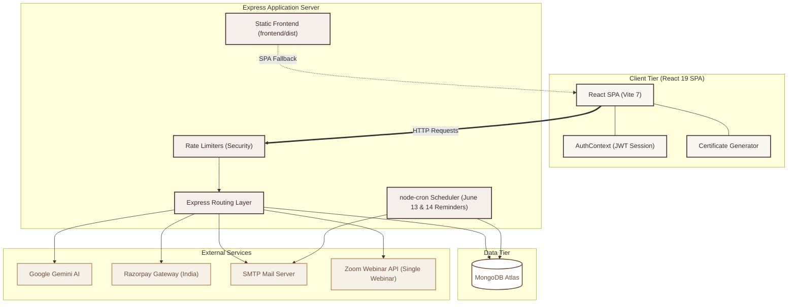
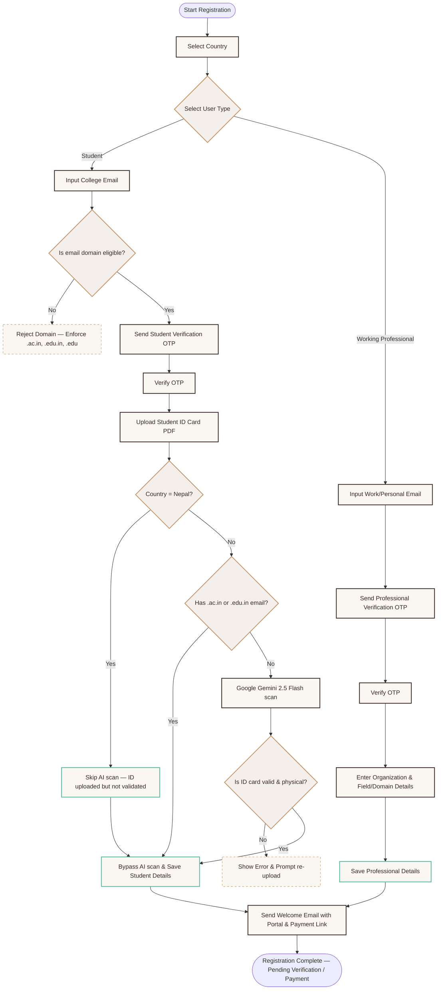
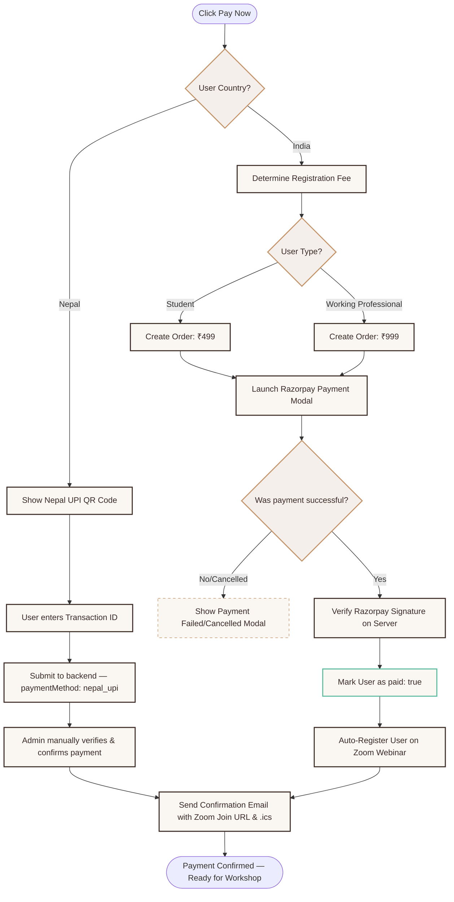

# Lead with AI — Full Stack Application

> **"Lead with AI: Adopt, Implement and Transform"**  
> A 2-day professional AI program hosted by **Global Knowledge Technologies** on **June 13 & 14, 2026**, offering hands-on learning in Generative AI for students and working professionals.

---

## Table of Contents

1. [Overview](#overview)
2. [Tech Stack](#tech-stack)
3. [Project Structure](#project-structure)
4. [System Architecture](#system-architecture)
5. [Workflow Diagrams](#workflow-diagrams)
6. [Pages & Features](#pages--features)
7. [API Reference](#api-reference)
8. [Database Schema](#database-schema)
9. [Authentication & Security](#authentication--security)
10. [Email System](#email-system)
11. [Admin Panel](#admin-panel)
12. [Environment Variables](#environment-variables)
13. [Getting Started](#getting-started)
14. [Design System](#design-system)

---

## Overview

**Lead with AI** is a full-stack event registration portal for a 2-day hands-on AI program. It combines a luxury-editorial frontend with a Node.js/Express backend to deliver:

- Animated public marketing site with program details, speaker bios, and curriculum
- **Fixed event date: June 13 & 14, 2026** — the only available date for registration
- **College email domain restriction** for students (`.ac.in`, `.edu.in`, `.edu` only)
- OTP-based passwordless auth with **separate emails** for verification vs. login
- **Forensic AI-powered student ID card scanning** (Google Gemini 2.5 Flash) via PDF uploads to auto-fill college details, specifically designed to reject digital mockups, screenshots, and AI-generated fakes
- **Nepal-specific payment flow**: Nepal users skip Razorpay entirely — instead a QR code is shown and they submit a UPI transaction ID for admin verification. No ID card AI validation for Nepal users (ID upload is still required)
- **Country-aware registration**: Users select India or Nepal during registration; country is stored and visible in admin panel
- **Persistent Marketing Attribution**: Captures `?ref=CODE` tracking parameters globally using session/local storage across page navigations
- **Mandatory Session Feedback & Certificate Generation**: Users must submit text feedback for four training sessions to unlock browser-side dynamic certificate generation
- Integrated **Razorpay payment gateway** (₹499 for students / ₹999 for professionals) — India users only
- Secure admin panel with user search/filter, comprehensive CSV exports, dynamic certificate preview, bulk email, and **country edit support**
- **Zoom Webinar integration**: Automatically registers paid participants to a single Zoom Webinar (one `ZOOM_WEBINAR_ID`) and generates unique join links
- Automated transactional emails: verification OTP, login OTP, registration confirmation, payment receipt with `.ics` calendar invite, and Day 1 & Day 2 reminder emails (June 13 & 14 only)
- **OTP rate limiting** via `express-rate-limit` to prevent brute-force and SMTP abuse
- **SPA routing fallback**: Backend serves `frontend/dist` and falls back to `index.html` for all non-API routes, enabling direct navigation to `/login`, `/profile`, etc.
- **Already-registered user guard**: If a user tries to register again with the same email, a popup is shown instead of allowing duplicate registration
- **Event date migration**: Users registered before the June 13 & 14 date was set are shown an "Event Date Update" modal on their profile, prompting a one-click migration to the correct date

---

## Tech Stack

### Frontend

| Category | Technology |
|---|---|
| Framework | React 19 |
| Bundler | Vite 7 |
| Routing | Wouter 3 |
| Styling | Vanilla CSS (bespoke design system) |
| Animation | Framer Motion |
| Icons | Lucide React + React Icons |
| Fonts | Playfair Display, EB Garamond, DM Sans (Google Fonts) |
| Utilities | HTML2Canvas, jsPDF (Certificate Generation) |

### Backend

| Category | Technology |
|---|---|
| Runtime | Node.js |
| Framework | Express 4 |
| Database | MongoDB Atlas (Mongoose 8) |
| Authentication | JWT (jsonwebtoken) + bcryptjs OTP hashing |
| Rate Limiting | express-rate-limit |
| Payments | Razorpay SDK (India only) |
| File Uploads | Multer (PDF only, max 5 MB) |
| AI OCR | Google Gemini 2.5 Flash (`@google/genai`) |
| Integrations | Zoom Server-to-Server OAuth API |
| Email | Nodemailer (SMTP — Microsoft Outlook) |
| Cron Jobs | node-cron (Day 1 & Day 2 reminder emails) |

---

## Project Structure

```
Next-Lead/
├── backend/
│   ├── src/
│   │   ├── middleware/
│   │   │   ├── auth.js                # JWT auth middleware (user)
│   │   │   ├── adminAuth.js           # JWT auth middleware (admin)
│   │   │   ├── validate.js            # Generic Joi validation middleware
│   │   │   └── auditLogger.js         # Logs administrative actions to DB
│   │   ├── models/
│   │   │   ├── User.js                # Mongoose User schema + OTP + Feedback methods
│   │   │   ├── Admin.js               # Admin credentials model
│   │   │   ├── Settings.js            # Global toggles (maintenance, feedback, cap, referrals)
│   │   │   └── AuditLog.js            # Admin actions history model
│   │   ├── routes/
│   │   │   ├── auth.js                # Registration, OTP, login, ID parse, change-cohort
│   │   │   ├── payment.js             # Razorpay order + verify + Nepal UPI submission + webhooks
│   │   │   └── admin.js               # Stats, users, bulk email, settings, referrals
│   │   └── utils/
│   │       ├── email.js               # All Nodemailer email templates
│   │       └── zoom.js                # Server-to-server Zoom OAuth & registration (single webinar)
│   ├── uploads/                       # Uploaded ID card PDFs (gitignored)
│   ├── index.js                       # Express entry point + rate limiters + cron + SPA fallback
│   ├── .env                           # Backend secrets (gitignored)
│   └── package.json
│
├── frontend/
│   ├── public/
│   │   ├── Logo.png                   # Main site logo
│   │   ├── LogoAdmin.png              # Admin sidebar logo
│   │   ├── CertificateTemplate.png    # Certificate background template
│   │   ├── Qr_code_Nepal.png          # Nepal UPI QR code (place file here before deploying)
│   │   └── ...                        # Speaker images, brochure, favicon
│   ├── src/
│   │   ├── components/
│   │   │   ├── NavBar.tsx
│   │   │   ├── Footer.tsx
│   │   │   ├── SixThings.tsx
│   │   │   ├── Autocomplete.tsx       # College autocomplete
│   │   │   └── ScrollToTop.tsx
│   │   ├── context/
│   │   │   └── AuthContext.tsx        # Global auth state (JWT + user)
│   │   ├── lib/
│   │   │   ├── api.ts                 # Fetch wrapper with env-aware base URL
│   │   │   └── assets.ts              # publicAsset() helper for /public files
│   │   ├── pages/
│   │   │   ├── Home.tsx
│   │   │   ├── Program.tsx
│   │   │   ├── Speakers.tsx
│   │   │   ├── Register.tsx           # Multi-step: OTP → Form → AI scan → Payment
│   │   │   ├── Profile.tsx            # Attendee profile + Feedback + Certificate + Date migration modal
│   │   │   └── admin/
│   │   │       ├── AdminLogin.tsx
│   │   │       ├── AdminLayout.tsx    # Sidebar with LogoAdmin.png
│   │   │       ├── AdminOverview.tsx
│   │   │       ├── AdminUsers.tsx     # Registrant table + filters + CSV export + country edit
│   │   │       └── AdminEmail.tsx
│   │   ├── index.css                  # Full design system
│   │   ├── admin.css
│   │   ├── App.tsx
│   │   └── main.tsx
│   ├── .env
│   └── package.json
│
├── .gitignore
└── README.md
```

---

## System Architecture


```mermaid
graph TD
    classDef client fill:#FAF7F2,stroke:#3B2F2F,stroke-width:2px,color:#3B2F2F;
    classDef backend fill:#F5EFEB,stroke:#3D2C26,stroke-width:2px,color:#3D2C26;
    classDef db fill:#FFFFFF,stroke:#6B4F3A,stroke-width:2px,color:#6B4F3A;
    classDef ext fill:#F5F0E8,stroke:#C4956A,stroke-width:2px,color:#6B4F3A;

    subgraph Client ["Client Tier (React 19 SPA)"]
        SPA["React SPA (Vite 7)"]:::client
        Auth["AuthContext (JWT Session)"]:::client
        Cert["Certificate Generator"]:::client
        SPA --- Auth
        SPA --- Cert
    end

    subgraph Server ["Express Application Server"]
        RL["Rate Limiters (Security)"]:::backend
        API["Express Routing Layer"]:::backend
        Cron["node-cron Scheduler (June 13 & 14 Reminders)"]:::backend
        Static["Static Frontend (frontend/dist)"]:::backend
        RL --> API
    end

    subgraph Storage ["Data Tier"]
        DB[(MongoDB Atlas)]:::db
    end

    subgraph Integrations ["External Services"]
        Gemini["Google Gemini AI"]:::ext
        Razorpay["Razorpay Gateway (India)"]:::ext
        SMTP["SMTP Mail Server"]:::ext
        Zoom["Zoom Webinar API (Single Webinar)"]:::ext
    end

    SPA ==>|HTTP Requests| RL
    API --> DB
    Cron --> DB
    API --> Gemini
    API --> Razorpay
    API --> SMTP
    API --> Zoom
    Cron --> SMTP
    Static -.->|SPA Fallback| SPA
```

---

## Workflow Diagrams

### Registration Flow


```mermaid
graph TD
    classDef step fill:#FAF7F2,stroke:#3D2C26,stroke-width:2px,color:#3D2C26;
    classDef decision fill:#F5EFEB,stroke:#C4956A,stroke-width:2px,color:#3D2C26;
    classDef success fill:#FAF7F2,stroke:#5CBA9E,stroke-width:2px,color:#3D2C26;
    classDef error fill:#FAF7F2,stroke:#C4956A,stroke-dasharray: 5 5,color:#3D2C26;

    Start([Start Registration]) --> CountrySelect[Select Country]:::step
    CountrySelect --> UserType{Select User Type}:::decision

    %% Student Branch
    UserType -->|Student| StudEmail[Input College Email]:::step
    StudEmail --> DomainCheck{Is email domain eligible?}:::decision
    DomainCheck -->|No| RejectDomain[Reject Domain — Enforce .ac.in, .edu.in, .edu]:::error
    DomainCheck -->|Yes| SendStudOTP[Send Student Verification OTP]:::step
    SendStudOTP --> VerifyStudOTP[Verify OTP]:::step
    VerifyStudOTP --> IDUpload[Upload Student ID Card PDF]:::step
    IDUpload --> CountryCheck{Country = Nepal?}:::decision
    CountryCheck -->|Yes| SkipScan[Skip AI scan — ID uploaded but not validated]:::success
    CountryCheck -->|No| BypassCheck{Has .ac.in or .edu.in email?}:::decision
    BypassCheck -->|Yes| SaveStudent[Bypass AI scan & Save Student Details]:::success
    BypassCheck -->|No| GeminiScan[Google Gemini 2.5 Flash scan]:::step
    GeminiScan --> OCRCheck{Is ID card valid & physical?}:::decision
    OCRCheck -->|No| RejectID[Show Error & Prompt re-upload]:::error
    OCRCheck -->|Yes| SaveStudent
    SkipScan --> SaveStudent

    %% Professional Branch
    UserType -->|Working Professional| ProfEmail[Input Work/Personal Email]:::step
    ProfEmail --> SendProfOTP[Send Professional Verification OTP]:::step
    SendProfOTP --> VerifyProfOTP[Verify OTP]:::step
    VerifyProfOTP --> InputProfDetails[Enter Organization & Field/Domain Details]:::step
    InputProfDetails --> SaveProfessional[Save Professional Details]:::success

    %% Common End
    SaveStudent --> WelcomeEmail[Send Welcome Email with Portal & Payment Link]:::step
    SaveProfessional --> WelcomeEmail
    WelcomeEmail --> End([Registration Complete — Pending Verification / Payment])
```

### Payment Flow


```mermaid
graph TD
    classDef step fill:#FAF7F2,stroke:#3D2C26,stroke-width:2px,color:#3D2C26;
    classDef decision fill:#F5EFEB,stroke:#C4956A,stroke-width:2px,color:#3D2C26;
    classDef success fill:#FAF7F2,stroke:#5CBA9E,stroke-width:2px,color:#3D2C26;
    classDef error fill:#FAF7F2,stroke:#C4956A,stroke-dasharray: 5 5,color:#3D2C26;

    Start([Click Pay Now]) --> CountryBranch{User Country?}:::decision

    %% Nepal Branch
    CountryBranch -->|Nepal| ShowQR[Show Nepal UPI QR Code]:::step
    ShowQR --> EnterTxnId[User enters Transaction ID]:::step
    EnterTxnId --> SubmitTxn[Submit to backend — paymentMethod: nepal_upi]:::step
    SubmitTxn --> AdminVerify[Admin manually verifies & confirms payment]:::step
    AdminVerify --> ConfirmEmail[Send Confirmation Email with Zoom Join URL & .ics]:::step

    %% India Branch
    CountryBranch -->|India| CheckType[Determine Registration Fee]:::step
    CheckType --> Fee{User Type?}:::decision
    Fee -->|Student| OrderStudent[Create Order: ₹499]:::step
    Fee -->|Working Professional| OrderProfessional[Create Order: ₹999]:::step
    OrderStudent --> PayModal[Launch Razorpay Payment Modal]:::step
    OrderProfessional --> PayModal
    PayModal --> PaymentStatus{Was payment successful?}:::decision
    PaymentStatus -->|No/Cancelled| ShowError[Show Payment Failed/Cancelled Modal]:::error
    PaymentStatus -->|Yes| VerifySignature[Verify Razorpay Signature on Server]:::step
    VerifySignature --> UpdateDB[Mark User as paid: true]:::success
    UpdateDB --> ZoomRegister[Auto-Register User on Zoom Webinar]:::step
    ZoomRegister --> ConfirmEmail
    ConfirmEmail --> End([Payment Confirmed — Ready for Workshop])
```

---

## Pages & Features

### Public Pages

| Route | Component | Description |
|---|---|---|
| `/` | `Home.tsx` | Hero, Six Takeaways grid, workshop schedule, speaker details, CTA |
| `/program` | `Program.tsx` | Full 2-day curriculum session details |
| `/speakers` | `Speakers.tsx` | Speaker cards and bios |
| `/register` | `Register.tsx` | Multi-step registration (Country → User type → Email Verification → Form → Payment) |
| `/profile` | `Profile.tsx` | Logged-in attendee page — payment status, Zoom link, feedback, certificate, date migration |
| `/login` | `Register.tsx` | Login via OTP (SPA route — works on direct URL access via server fallback) |

### Register.tsx — Key Features

- **Country selection first**: User selects India or Nepal before anything else — drives payment flow and ID validation behaviour
- **Already-registered guard**: If the email is already in use, shows an informational popup instead of an error
- **College email domain guard** (students): enforces `.ac.in`, `.edu.in`, `.edu` client-side and server-side
- **Mandatory Student ID Card Upload**: Required for all student registrations. Only `.pdf` accepted
- **Gemini scan bypass**: `.ac.in` / `.edu.in` users bypass AI forensic validation. Nepal students always bypass AI scan but still upload ID
- **Separate OTP emails**: Verification OTP vs Login OTP
- **International phone validation**: Phone numbers validated with international format support
- **Tiered pricing (India only)**: Students pay ₹499, working professionals pay ₹999
- **Nepal payment**: QR code shown + transaction ID field only (no Razorpay, no screenshot upload)
- **Persistent Marketing Attribution**: Captures `?ref=CODE` and assigns it to the user

### Profile.tsx — Key Features

- Shows registered event, payment status, country, and Zoom link (post-payment)
- **"Verification Pending" badge** for Nepal users awaiting admin confirmation (no payment pending box)
- **Transaction ID display** shown below the badge for Nepal users
- **Event Date Migration Modal**: Users registered with an old date see a blocking "Event Date Update" popup; clicking "Update Date & Continue" calls `POST /api/auth/change-cohort` and updates their record (also re-registers them for Zoom if already paid)
- **Scroll Lock on Modal Show**: Prevents body scrolling when modals are displayed
- **Dynamic Payment Update Modal**: Renders "Payment Cancelled" or "Payment Failed" states
- **Session Feedback System**: Users provide text feedback for 4 training sessions post-event
- **Dynamic Certificate Generator**: Unlocked after feedback submission; generates downloadable certificate in-browser

### Admin Panel (Protected)

| Route | Component | Description |
|---|---|---|
| `/admin/login` | `AdminLogin.tsx` | Admin email + password login |
| `/admin/dashboard` | `AdminOverview.tsx` | Stats: total, paid, revenue, source distributions, recent sign-ups |
| `/admin/users` | `AdminUsers.tsx` | Full registrant table + filters + CSV export + country edit |
| `/admin/email` | `AdminEmail.tsx` | Bulk email composer |

**Admin Dashboard Key Features:**
- **Country field in Edit User modal**: Admin can view and change a user's country (India / Nepal / Other). Old users without a country default to India
- **Country shown in user detail**: Country is always displayed in the payment section of the user detail drawer
- **Nepal payment controls**: "Verify & Confirm" and "Reject Proof" buttons shown for `nepal_upi` payment method users
- **Attribution & Sources Filter**: "Heard From" source filter to segregate users by marketing channel
- **Dynamic Source Distribution Chart**: Pie chart mapping attendee sources
- **Advanced CSV Export**: Exports comprehensive user data including country, referral codes, payment IDs, and form submissions
- **Dynamic Certificate Preview**: Internal tooling to preview the certificate layout
- **System Settings Controls**: Real-time management of maintenance mode, feedback visibility, registration cap, and referral codes

---

## API Reference

> **Base URL (dev):** `http://localhost:4000`  
> **Protected routes:** `Authorization: Bearer <JWT>`

### Auth — `/api/auth`

| Method | Endpoint | Auth | Description |
|---|---|---|---|
| `POST` | `/send-register-otp` | None | Check email uniqueness + domain → send verification OTP |
| `POST` | `/verify-register-otp` | None | Verify OTP; marks email eligible for registration |
| `POST` | `/parse-id` | None | Upload ID card PDF (max 5 MB); Gemini forensic validation & extraction |
| `POST` | `/register` | None | Create account (requires verified email); saves `referralCode`, `country` |
| `POST` | `/send-otp` | None | Send login OTP to existing user |
| `POST` | `/verify-otp` | None | bcrypt OTP verify → JWT |
| `GET` | `/me` | ✅ JWT | Full user profile |
| `POST` | `/submit-feedback` | ✅ JWT | Submit session feedback |
| `POST` | `/change-cohort` | ✅ JWT | Update user's selected event date to June 13 & 14, 2026; re-registers Zoom if paid |

### Payment — `/api/payment`

| Method | Endpoint | Auth | Description |
|---|---|---|---|
| `POST` | `/create-order` | ✅ JWT | Creates Razorpay order (India users only) |
| `POST` | `/verify` | ✅ JWT | HMAC-SHA256 verify → marks payment confirmed; registers Zoom; sends receipt email |
| `POST` | `/nepal-upi` | ✅ JWT | Submits Nepal UPI transaction ID for admin verification |
| `POST` | `/webhook` | None | Razorpay webhook handler for async payment confirmation |

### Public Settings — `/api/public/settings`

| Method | Endpoint | Auth | Description |
|---|---|---|---|
| `GET` | `/` | None | Fetch feedback toggle, maintenance mode, and registration settings |

### Admin — `/api/admin`

| Method | Endpoint | Auth | Description |
|---|---|---|---|
| `POST` | `/login` | None | Admin login → admin JWT (24h) |
| `POST` | `/` | None/Admin | Create a new Admin account (open if 0 admins exist; requires auth otherwise) |
| `GET` | `/` | ✅ Admin | Get all admins list |
| `DELETE` | `/:adminId` | ✅ Admin | Delete an admin |
| `GET` | `/audit-logs` | ✅ Admin | View actions history logs |
| `GET` | `/stats` | ✅ Admin | Total users, paid count, referral breakdown, heardFrom stats, 5 recent sign-ups |
| `GET` | `/users` | ✅ Admin | All registrants including `referralCode`, `feedback`, `isPaid`, `country` |
| `POST` | `/users` | ✅ Admin | Add a registrant manually |
| `GET` | `/users/:id` | ✅ Admin | Single user detail |
| `PATCH` | `/users/:id` | ✅ Admin | Edit a registrant's details (supports `country` field) |
| `PATCH` | `/users/:id/status` | ✅ Admin | Toggle registrant active/inactive status |
| `PATCH` | `/users/:id/waitlist` | ✅ Admin | Toggle registrant waitlist status |
| `POST` | `/users/:id/confirm-payment` | ✅ Admin | Manually confirm a registrant's payment |
| `DELETE` | `/users/:id` | ✅ Admin | Delete a registrant |
| `POST` | `/users/:id/retry-zoom` | ✅ Admin | Force retry Zoom registration for paid user |
| `POST` | `/users/:id/retry-email` | ✅ Admin | Force resend payment receipt/calendar event email |
| `POST` | `/send-email` | ✅ Admin | Bulk email to `all` / `paid` / `custom` list |
| `GET` | `/feedback` | ✅ Admin | Retrieve all feedback entries |
| `GET` | `/settings` | ✅ Admin | Fetch internal configuration options |
| `PATCH` | `/settings/feedback` | ✅ Admin | Toggle dynamic session feedback form availability |
| `PATCH` | `/settings/maintenance` | ✅ Admin | Toggle maintenance mode |
| `PATCH` | `/settings/cap` | ✅ Admin | Update maximum registration cap |
| `GET` | `/settings/referrals` | ✅ Admin | Get active referral codes |
| `POST` | `/settings/referrals` | ✅ Admin | Add a new referral code |
| `PATCH` | `/settings/referrals/:code` | ✅ Admin | Toggle referral code active status |
| `PUT` | `/settings/referrals/:code/label` | ✅ Admin | Update referral code label |
| `DELETE` | `/settings/referrals/:code` | ✅ Admin | Delete a referral code |

---

## Database Schema

### `User` Collection

```js
{
  fullName:   String (required, trimmed),
  email:      String (unique, lowercase),
  phone:      String (required),                // International format validated
  userType:   "student" | "working",
  country:    String (default: "India"),        // "India" | "Nepal" | "Other"

  // Student-only
  collegeName:      String,
  course:           String,
  year:             String,                     // e.g. "3rd Year"
  idCardPath:       String,                     // filename of PDF in /uploads

  // Working professional-only
  domain:       String,
  organization: String,

  // OTP login (cleared after use)
  otpHash:    String,   // bcrypt hash
  otpExpiry:  Date,     // 10-min TTL

  // Registration metadata
  heardFrom:      String,
  isWaitlisted:   Boolean,
  isActive:       Boolean,
  referralCode:   String,
  selectedCohort: String,   // "June 13 & 14, 2026"
  isProfileComplete: Boolean,

  // Nepal UPI payment
  paymentMethod:   String,   // "razorpay" | "nepal_upi"
  nepalUpiTxnRef:  String,   // Transaction ID submitted by Nepal user

  // Session Feedback System
  feedback: [{
    session: String,
    text:    String
  }],
  isFeedbackSubmitted: Boolean,

  // Events
  registeredEvents: [{
    eventName:               String,
    razorpayOrderId:         String,
    razorpayPaymentId:       String,
    paymentStatus:           "pending" | "confirmed" | "failed",
    zoomRegistrationStatus:  "pending" | "success" | "failed",
    emailConfirmationStatus: "pending" | "success" | "failed",
    zoomJoinUrl:             String,
    registeredAt:            Date,
  }],

  createdAt: Date,
  updatedAt: Date,
}
```

### `Settings` Collection

```js
{
  feedbackEnabled:   Boolean (default: false),
  isMaintenanceMode: Boolean (default: false),
  registrationCap:   Number (default: 1000),
  referralCodes: [{
    code:     String,
    label:    String,
    isActive: Boolean
  }],
  createdAt: Date,
  updatedAt: Date
}
```

### `AuditLog` Collection

```js
{
  adminId:    ObjectId (ref: 'Admin'),
  adminName:  String,
  adminEmail: String,
  action:     String (required),
  target:     String,
  details:    Schema.Types.Mixed,
  ipAddress:  String,
  userAgent:  String,
  createdAt:  Date,
  updatedAt:  Date
}
```

---

## Authentication & Security

### Registration — 3-Step

1. `POST /send-register-otp` — validates email uniqueness + domain; stores OTP in in-memory Map (10 min TTL)
2. `POST /verify-register-otp` — validates OTP; adds to `verifiedEmails` Set
3. `POST /register` — rejects if email not in Set; creates user; clears email from Set

### Login — 2-Step

1. `POST /send-otp` → bcrypt-hashed OTP stored in MongoDB
2. `POST /verify-otp` → `bcrypt.compare()` + expiry check → JWT (30 days), OTP cleared from DB

### OTP Rate Limiting

| Route | Limit | Window |
|---|---|---|
| `send-otp`, `send-register-otp` | 5 requests | 15 min |
| `verify-otp`, `verify-register-otp` | 10 attempts | 15 min |
| `register` | 5 attempts | 15 min |

---

## Email System

All HTML transactional emails are formatted in a premium beige color schema with a clean, responsive template structure.

| Function | Trigger | Type | Notes |
|---|---|---|---|
| `sendVerificationOtpEmail()` | Registration email OTP | HTML | "Your OTP for Email Verification" |
| `sendOtpEmail()` | Login OTP | HTML | "Your Login OTP, [FirstName]" |
| `sendRegistrationEmail()` | Account created | HTML | Welcome email with payment reminder, pricing context & portal link |
| `sendPaymentConfirmationEmail()` | Payment verified | HTML | Seat confirmation with Zoom Join URL + `.ics` calendar invite (Date: June 13 & 14, 2026) |
| `sendCustomBulkEmail()` | Admin bulk send | HTML | Admin bulk messaging sent as BCC |
| `sendReminderEmail()` | Cron — Day before June 13 | HTML | Day 1 reminder with Zoom join link (paid users only) |
| `sendDay2ReminderEmail()` | Cron — End of June 13 | HTML | Day 2 reminder with Zoom join link (paid users only) |
| `sendProfileApprovedEmail()` | Manual admin approval | HTML | Sent when admin manually confirms a pending Nepal UPI payment |

---

## Environment Variables

### Backend (`backend/.env`)

```env
PORT=4002
MONGO_URI=mongodb+srv://<user>:<pass>@cluster0.xxx.mongodb.net/LeadWithAI
MONGO_DB_NAME=LeadWithAI
COLLECTION_NAME=Users

JWT_SECRET=<strong_random_secret>

RAZORPAY_KEY_ID=rzp_test_xxxxxxxxxxxx
RAZORPAY_KEY_SECRET=<razorpay_secret>
RAZORPAY_WEBHOOK_SECRET=<webhook_secret>

SMTP_HOST=smtp-mail.outlook.com
SMTP_PORT=587
SMTP_USER=events@yourdomain.com
SMTP_PASS=<smtp_password>
FROM_EMAIL=events@yourdomain.com
FROM_NAME=Lead with AI

GEMINI_API_KEY=<gemini_api_key>

SITE_URL=https://www.globalknowledgetech.com/leadwithAI

ZOOM_ACCOUNT_ID=<zoom_account_id>
ZOOM_CLIENT_ID=<zoom_client_id>
ZOOM_CLIENT_SECRET=<zoom_client_secret>
ZOOM_WEBINAR_ID=<single_zoom_webinar_id>
```

### Frontend (`frontend/.env`)

```env
VITE_API_URL=http://localhost:4002
```

> ⚠️ **Never commit `.env` files.** Both are in `.gitignore`.

---

## Getting Started

### Prerequisites

- Node.js v18+
- MongoDB Atlas (or local MongoDB)
- Razorpay account (test or live) — for India users
- Google Gemini API key
- Zoom Account with Server-to-Server OAuth credentials and one Webinar ID
- SMTP email account (Microsoft Outlook)

### Installation

```bash
git clone https://github.com/akshayaav246-collab/LeadwithAI.git
cd LeadwithAI

cd backend && npm install
cd ../frontend && npm install
```

### Run Development

```bash
# Terminal 1 — Backend
cd backend
npm run dev
# → http://localhost:4002

# Terminal 2 — Frontend
cd frontend
npm run dev
# → http://localhost:5173
```

### Nepal QR Code Setup

Place the Nepal UPI QR code image at:

```
frontend/public/Qr_code_Nepal.png
```

This file is gitignored and must be placed on the server directly before starting. The frontend reads it via the `publicAsset()` helper.

---

## Design System

Bespoke luxury-editorial CSS in `frontend/src/index.css`:

**Color palette (CSS variables):**

| Variable | Value | Usage |
|---|---|---|
| `--color-cream` | `#FAF7F2` | Page background |
| `--color-linen` | `#F5F0E8` | Card backgrounds |
| `--color-sienna` | `#C4956A` | Primary accent, buttons, links |
| `--color-espresso` | `#3B2F2F` | Dark headings, navbar |
| `--color-umber` | `#6B4F3A` | Body text, hints |
| `--color-stone` | `#8C7B6B` | Labels, muted text |
| `--color-amber-deep` | `#966638` | Error/validation messages |

**Typography:** `Playfair Display` (headings) · `EB Garamond` (body) · `DM Sans` (UI)

---

## License

This project is private and proprietary to **Global Knowledge Technologies**. All rights reserved.
